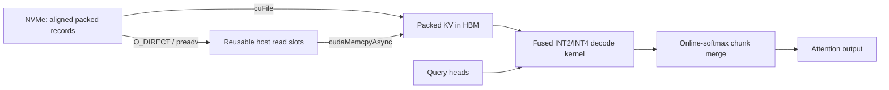

# KVSSD Attention

[](https://github.com/manishklach/kvssd-attention/actions/workflows/ci.yml)
[](https://github.com/manishklach/kvssd-attention/releases)
[](LICENSE)
[](pyproject.toml)

KVSSD Attention is a reference implementation of this serving path:

```text
2-bit or 4-bit KV blocks on NVMe
  → bounded asynchronous reads
  → GDS direct-to-GPU or aligned/pinned fallback staging
  → fused Triton or CUDA register-level dequantization and decode attention
```

The project is deliberately narrow. It implements single-query-token decode attention, including
grouped-query attention (GQA), rather than presenting an entire LLM server. The Python API is small
enough to integrate into a serving runtime, while the storage format, scheduler boundary, and CUDA
kernel are independently testable.

## Why this exists

Long-context decoding repeatedly reads a growing KV cache. Quantization reduces those bytes, but
capacity alone is not enough: a useful storage-tiered design must coordinate SSD layout, read queue
depth, pinned-memory ownership, PCIe transfers, CUDA streams, and attention numerics. KVSSD Attention
puts those pieces in one auditable repository instead of measuring an isolated codec or kernel.

The central rule is that a decompressed cache is never materialized in HBM. Packed blocks move from
storage to the GPU, and the CUDA kernel reconstructs individual values only when they are consumed.

## Project status

The `v0.2` branch is an adoption-focused expansion of the original reference release. Portable CPU,
Linux `O_DIRECT`, Triton-interpreter, and vLLM source-contract paths are validated in CI. Physical
NVIDIA, NVIDIA GDS, and AMD/ROCm tests are isolated in an opt-in hardware workflow; no hardware path
or performance result is claimed until its job has passed on the named machine.

## What is implemented

- Symmetric groupwise INT2 and INT4 quantization with FP16 scales.
- Fixed-size, 4 KiB-aligned, append-only SSD records with per-record CRC32.
- Pluggable block selection (`AllBlocks` and sink-plus-recent are included).
- Observable storage selection: cuFile GDS → Linux `O_DIRECT` → buffered `preadv`.
- Aligned CUDA and host allocators, bounded asynchronous loading, and explicit short-read diagnostics.
- Pinned, coalesced staging buffers and dedicated CUDA transfer/compute streams.
- Chunked H2D/compute overlap with numerically correct online-softmax result merging.
- Fused CUDA and portable Triton kernels that unpack and dequantize K/V in registers and never write a full
  decompressed KV cache to HBM.
- A vLLM 0.25 custom secondary tier that asynchronously stores INT2/INT4 prefix blocks using stable
  hash/group identifiers and reloads through vLLM's CPU primary tier.
- CPU reference implementation, capability-aware CLI, reproducible benchmark JSON, and CI.

## Quick start

CPU/reference installation and validation:

```bash
python -m venv .venv
source .venv/bin/activate
pip install -e '.[dev]'
pytest

kvssd create-demo /tmp/demo-kv --tokens 4096 --bits 4
kvssd inspect /tmp/demo-kv
kvssd benchmark --cpu --tokens 8192 --bits 4
```

CUDA fast-path installation requires a CUDA-enabled PyTorch installation, the CUDA toolkit, and a
working C++ compiler:

```bash
pip install torch --index-url https://download.pytorch.org/whl/cu128
KVSSD_BUILD_CUDA=1 pip install -e . --no-build-isolation
kvssd benchmark --tokens 131072 --bits 4 --require-cuda
```

Use the PyTorch CUDA wheel/index appropriate for your driver; `cu128` above is only an example.

Triton is optional and supports NVIDIA CUDA or AMD ROCm through the same kernel:

```bash
pip install -e '.[triton]'
kvssd benchmark --attention-backend triton --tokens 131072 --bits 4
```

GPUDirect Storage additionally requires Linux, NVIDIA CUDA/GDS, `libcufile` headers and library, a
GDS-capable filesystem, and aligned records. Explicit selection fails closed; `auto` safely falls
through to `O_DIRECT` or buffered reads:

```bash
KVSSD_BUILD_GDS=1 pip install -e . --no-build-isolation
kvssd inspect /mnt/nvme/demo-kv --storage-backend gds
kvssd benchmark --storage-backend gds --attention-backend triton
```

See [docs/gds.md](docs/gds.md) for setup and diagnostics and
[docs/vllm.md](docs/vllm.md) for the vLLM proof-of-concept configuration.

## Python example

```python
import torch
from kvssd import CacheSpec, KVCacheStore, KVSSDPipeline, RecentSinkBlocks

# K/V layout: [layers, tokens, kv_heads, head_dim]
keys = torch.randn(32, 65_536, 8, 128, dtype=torch.float16)
values = torch.randn_like(keys)
spec = CacheSpec(
    layers=32,
    kv_heads=8,
    head_dim=128,
    block_tokens=128,
    bits=4,
    group_size=32,
)
store = KVCacheStore.create("./cache", keys, values, spec)

# Query layout: [query_heads, head_dim]; 32 query heads / 8 KV heads is GQA(4).
query = torch.randn(32, 128, device="cuda", dtype=torch.float16)
with KVSSDPipeline(store, stage_blocks=4, require_cuda_kernel=True) as pipeline:
    output = pipeline.decode(query, layer=0, selector=RecentSinkBlocks(sink=1, recent=32))
```

`KVCacheStore.create` is an offline/reference writer. A production integration should append blocks
directly as prefill produces them rather than assembling a full in-memory tensor first.

## Data path



Reads for later blocks are issued while earlier reads are consumed. On CUDA, packed chunks are
transferred on one stream and processed on another. Each chunk returns its normalized attention
output and log-sum-exp; those statistics allow exact softmax merging across chunks without retaining
the attention matrix.

## Supported fast-path layout

| Property | Current contract |
|---|---|
| Decode query length | 1 |
| KV bits | 2 or 4 |
| Scale type | FP16 |
| Quantization | Symmetric, per token/head/group |
| Head dimension | Up to 256, divisible by group size |
| Attention | MHA, MQA, or GQA |
| Record alignment | 4096 bytes |
| Query dtype | FP16, BF16, or FP32 |
| Triton devices | NVIDIA CUDA or AMD ROCm on Linux |
| Storage selection | GDS, `O_DIRECT`, buffered |

## Performance interpretation

The CPU fallback verifies semantics; it is not a performance implementation. GPU measurements should
separate these quantities:

1. storage read bandwidth and queue depth;
2. pinned staging and H2D bandwidth;
3. fused-kernel time;
4. end-to-end time, including selection and synchronization;
5. quantization-induced task-quality change.

The included `effective_read_gib_s` metric is end-to-end payload throughput, not the SSD's raw media
bandwidth. See [docs/benchmarking.md](docs/benchmarking.md) for the benchmark protocol.

## Deliberate limitations

- The CUDA kernel favors clarity and auditability over architecture-specific tensor-core tuning.
- The included selectors do not implement semantic top-k retrieval. The selector interface is the
  intended integration point for block centroids, retrieval heads, or an external scheduler.
- vLLM's public secondary-tier contract stages through its CPU primary tier. It validates persistent
  packed prefix reuse, but it does not replace vLLM PagedAttention with KVSSD fused attention.
- cuFile support is an optional source build and requires a self-hosted GDS runner for validation.
- Quantization quality must be evaluated on the target model and task. INT2 is not automatically safe.
- Windows can run the CPU tests, but the production CUDA/SSD target is Linux.

These constraints are explicit so benchmark results cannot silently compare a fallback against a
requested fast path. Explicit `--attention-backend`, `--storage-backend`, and `--require-cuda`
selections fail closed; benchmark JSON records both selected capability reports and runtime versions.

## License

Apache-2.0.

See [CHANGELOG.md](CHANGELOG.md) for release history and
[CONTRIBUTING.md](CONTRIBUTING.md) for validation requirements.

The prioritized post-v0.1 architecture and hardware-gated acceptance criteria are documented in
[docs/v0.2-design.md](docs/v0.2-design.md).
